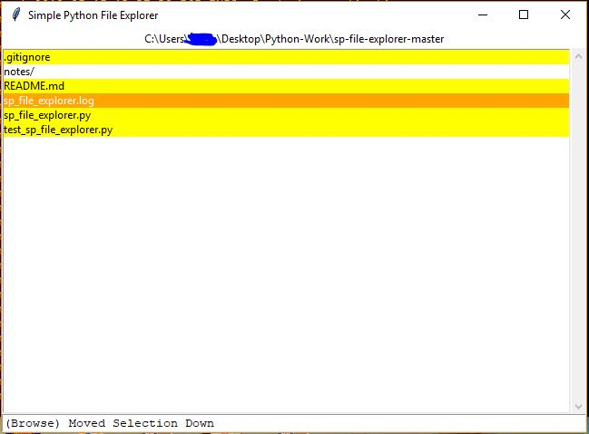
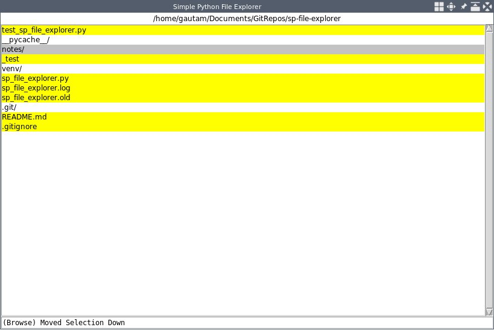

# sp-file-explorer (Simple Python File Explorer)

sp-file-explorer is a file explorer app with keybindings (no mouse clicks) written in Python.

The application does make use of the following libraries 
   
    - tkinter
    - os
    - logging
    - unittest
    - copy

all of which are available from a standard python installation.
It does not make use of libraries outside what is available in Python's Standard Library,
so it should work on any machine which runs python.

## To Use

Run the python script file 
```
$ python sp_file_explorer.py
```

## Pictures

Here is how the application looks in a Windows 10 machine.



Here is how the application looks in an Arch Linux machine running Awesome WM.



## Keybindings

As of now, only four keys are supported to make the application run.

 - Up Arrow Key: Move selection up
 - Down Arrow Key: Move selection down
 - Shift-Up: Ascend to parent directory
 - Shift-Down: Descend to child directory
